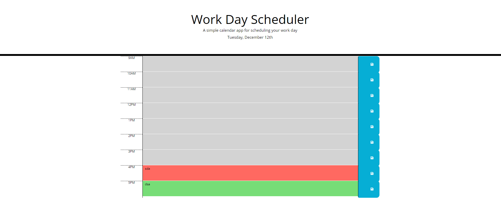

# Work_Day_Planner
 A planner application that allows a user to save events for each hour of the day

 ## Installation

N/A

## Usage

You can try out the Javascript coding quiz if you click this link:

https://sara-badini-confalonieri.github.io/Work_Day_Planner/

* Enter an event in a choosen timeblock
* The Current hour will display in red, past ours in gray and still avaliable hour in green
* Click on the 'Save' button to save your events in the local storage.
* Refresh the page to see your saved result still showing.

## Credits

N/A

## License

Please refer to the LICENSE in the repo.
